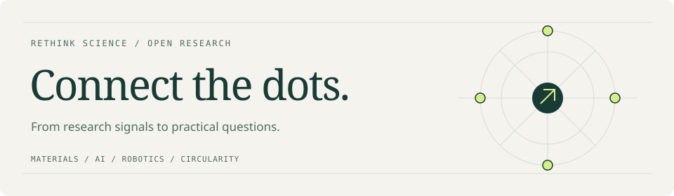

<picture>
  <source media="(prefers-color-scheme: dark)" srcset="assets/profile-dark.svg">
  
</picture>

# Rethink Science

**Open-source tools and focused intelligence for emerging technologies.**

I build projects that connect research, industry signals and practical engineering questions across **materials, AI, robotics and circularity**.

[Explore the research garden](https://rethinksci-gif.github.io/) · [Read AIM4R](https://rethinksci-gif.github.io/AIM4R/) · [Read Plastic Signal](https://rethinksci-gif.github.io/plastic-signal-weekly/)

## Three ways to explore

### 01 / Research garden

**Connected notes. Better questions.**

An evolving collection of research notes and engineering case studies—from materials informatics and embodied AI to recycling and circular manufacturing.

[Explore the garden ↗](https://rethinksci-gif.github.io/) · [Engineering case notes](https://rethinksci-gif.github.io/engineering-case-notes/) · [Source](https://github.com/rethinksci-gif/rethinksci-gif.github.io)

---

### 02 / AIM4R

**Daily intelligence · 中文 / English**

A bilingual research briefing for following robotics, embodied intelligence and materials, with dated archives, source links and reading controls.

[Read the daily digest ↗](https://rethinksci-gif.github.io/AIM4R/) · [中文 RSS](https://rethinksci-gif.github.io/AIM4R/feed-zh.xml) · [English RSS](https://rethinksci-gif.github.io/AIM4R/feed-en.xml) · [Source](https://github.com/rethinksci-gif/AIM4R)

---

### 03 / Plastic Signal Weekly

**Weekly intelligence · English**

A decision-focused briefing on plastics innovation: circular materials, recycling technology, material performance, regulation, supply chains and research.

[Read the weekly brief ↗](https://rethinksci-gif.github.io/plastic-signal-weekly/) · [RSS](https://rethinksci-gif.github.io/plastic-signal-weekly/feed-en.xml) · [Source](https://github.com/rethinksci-gif/plastic-signal-weekly)

## What connects the work

- **Materials × AI** — research discovery, materials informatics and property prediction.
- **Robotics × research** — embodied intelligence and autonomous experimentation.
- **Circularity × engineering** — recycled polymers, manufacturing and practical diagnosis.

> Collect signals → examine the evidence → connect ideas → frame the next question.

中文简介

这里汇集材料、人工智能、机器人与循环经济方向的研究笔记、工程案例和情报工具。

- **知识花园**：沿主题阅读互相关联的笔记与工程案例。
- **AIM4R**：中英双语日报，追踪研究与技术动态。
- **Plastic Signal Weekly**：面向塑料产业的英文周刊，关注材料创新与实际决策。

---

Built in the open. Follow the projects, read the sources, and explore the connections.
